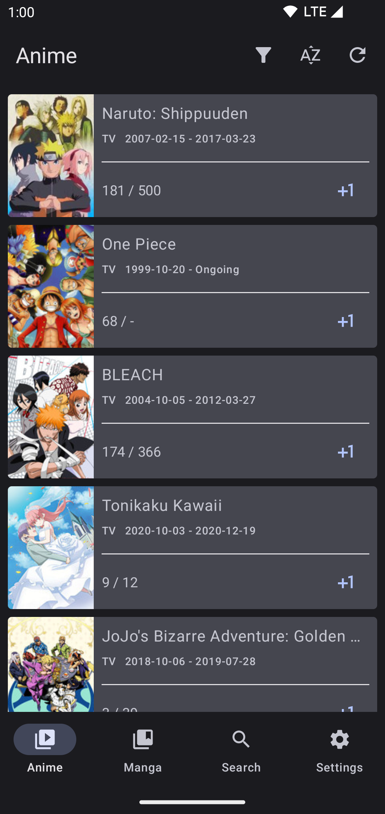
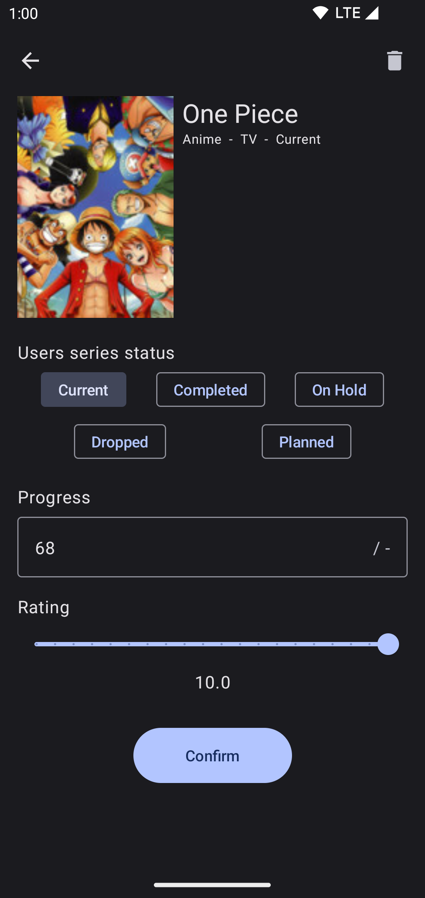

# Nekome


[](https://app.bitrise.io/app/9d4a9399b9f5d683)
[](https://codecov.io/gh/Chesire/Nekome)

Nekome is an Android application that helps with tracking your anime and manga watch lists. Watch list data is handled by [Kitsu](https://kitsu.io/).

[](https://f-droid.org/packages/com.chesire.nekome/)
[](https://play.google.com/store/apps/details?id=com.chesire.nekome)

<p>


</p>

## Features

* Track Anime and Manga series progress
* Quickly update progress on series
* Search for new series to follow
* Light and Dark themes

## Tech Stack

* Support for Android 5.0+ (SDK 21+)
* Fully Kotlin
* Uses [Kitsu](https://kitsu.io/) to store information, all accessed through [their API](https://kitsu.docs.apiary.io/)
* [MVVM](https://developer.android.com/topic/libraries/architecture) for the architecture
* [Compose](https://developer.android.com/jetpack/compose) for the UI layer
* [Material3](https://developer.android.com/jetpack/compose/designsystems/material3) support for dynamic themes using Material 3
* [Hilt](https://dagger.dev/hilt/) for dependency injection
* [Retrofit](https://github.com/square/retrofit) to aid with API communicaton
* [Moshi](https://github.com/square/moshi) for parsing JSON
* [Coroutines](https://github.com/Kotlin/kotlinx.coroutines) to perform async tasks
* [Coil](https://github.com/coil-kt/coil) for async image loading
* [Detekt](https://github.com/arturbosch/detekt) & [ktlint](https://github.com/pinterest/ktlint) are used for static analysis

## Building from Source

### Requirements
- **Android Studio** Ladybug (2024.2.1) or newer
- **JDK** 17 or newer
- **Android SDK** with API 35
- **Gradle** 8.11.1+ (included via wrapper)

### Dependencies Versions
- **Kotlin** 2.0.20
- **Android Gradle Plugin** 8.11.2
- **Compose** via Compose Compiler Plugin
- **Min SDK** 21 (Android 5.0)
- **Target SDK** 35 (Android 15)

### Setup

1. **Clone the repository:**
   ```bash
   git clone https://github.com/Chesire/Nekome.git
   cd Nekome
   ```

2. **Open in Android Studio:**
   - Open Android Studio
   - File → Open → Select project folder
   - Wait for Gradle sync to complete

3. **Build the project:**
   ```bash
   ./gradlew assembleDebug
   ```

4. **Run tests:**
   ```bash
   # Unit tests
   ./gradlew test
   
   # UI tests (requires device/emulator)
   ./gradlew connectedDebugAndroidTest
   
   # Marathon tests with Allure reports (recommended)
   ./run_marathon.sh
   ```

5. **Install on device:**
   ```bash
   ./gradlew installDebug
   ```

### Project Structure

```
nekome/
├── app/                    # Main application module
├── core/                   # Core modules
│   ├── compose/           # Compose UI components
│   ├── preferences/       # User preferences
│   └── resources/         # Shared resources
├── features/              # Feature modules
│   ├── login/            # Login feature
│   ├── search/           # Search feature
│   ├── series/           # Series list feature
│   ├── serieswidget/     # Home screen widget
│   └── settings/         # Settings feature
└── libraries/            # Internal libraries
    ├── core/             # Core utilities
    ├── database/         # Room database
    ├── datasource/       # Data sources (auth, series, etc.)
    └── kitsu/            # Kitsu API integration
```

## 🧪 Test Automation

This project includes a comprehensive test automation framework built with **Kaspresso** and **Marathon**.

### Quick Start

```bash
# Run all automated UI tests with Marathon
./run_marathon.sh

# Quick run (if Marathon already downloaded)
./marathon_quick.sh

# View Allure reports
open marathon/html/index.html
```

### Test Coverage

- ✅ **18 automated UI tests** covering critical user flows
- ✅ **Login & Authentication** flows
- ✅ **Series Collection** screen and navigation
- ✅ **Series Cards** display and interaction
- ✅ **Detail Screen** with all UI blocks
- ✅ **Progress Block** with comprehensive validation testing
- ✅ **Counter Increment** functionality
- ✅ **Auto-hide** behavior on completion

### Test Infrastructure

**Framework & Tools:**
- **Kaspresso 1.5.5** - UI testing framework
- **Kakao Compose 0.4.3** - Compose testing DSL
- **Marathon 0.6.5** - Parallel test execution
- **Allure 2.4.0** - Test reporting
- **Hilt** - Dependency injection for tests

**Architecture:**
- Page Object Pattern for maintainability
- Scenario Pattern for reusable flows
- Custom Compose Nodes for complex UI elements
- Custom Assertions and Helpers
- Full test isolation with automatic cleanup

### Test Results

Latest test run: **15/18 passed** (83.3% success rate)

3 failed tests revealed real bugs in the Progress validation! 🐛

For detailed documentation, see:
- [Test Task Summary](TEST_TASK_SUMMARY.md) - Full implementation details
- [Test Cases](docs/test-cases/) - Documented test scenarios
- [Marathon Setup](FINAL_MARATHON_SUMMARY.md) - Marathon configuration

### Running Tests

#### Option 1: Marathon (Recommended)
```bash
./run_marathon.sh           # First run
./marathon_quick.sh         # Subsequent runs
```

Results in `marathon/html/index.html`

#### Option 2: Gradle
```bash
# All tests
./gradlew connectedDebugAndroidTest

# Specific test class
./gradlew connectedDebugAndroidTest --tests "com.chesire.nekome.tests.CollectionScreenTest"

# Single test
./gradlew connectedDebugAndroidTest --tests "*.ItemScreenProgressBlockTest.enteringCorrectValue"
```

#### Option 3: Android Studio
1. Open test file in `app/src/androidTest/`
2. Click ▶️ next to test method
3. Select device/emulator

### Test Structure

```
app/src/androidTest/
├── base/                      # Base test classes
├── helpers/                   # Custom helpers & assertions
│   ├── annotations/          # @Debug annotation
│   ├── kNodes/              # Custom Compose Nodes
│   └── scenario/            # Reusable scenarios
├── pageobjects/              # Page Object classes
│   ├── LoginScreen.kt
│   ├── CollectionScreen.kt
│   └── ItemScreen.kt
└── tests/                    # Test implementations
    ├── CollectionScreenTest.kt        (6 tests)
    ├── ItemScreenTest.kt              (2 tests)
    ├── ItemScreenProgressBlockTest.kt (7 tests)
    └── LoginFlowComposeTest.kt        (3 tests)
```

### CI/CD Ready

The test infrastructure is **ready for CI/CD integration**:
- ✅ Isolated tests (no side effects)
- ✅ Marathon for parallel execution
- ✅ Allure reports generation
- ✅ Automatic scripts
- ✅ Test filtering by annotations

Just add a CI configuration file (examples provided in TEST_TASK_SUMMARY.md)

### Code Quality

```bash
# Run static analysis
./gradlew detekt

# Run linting
./gradlew ktlintCheck

# Auto-format code
./gradlew ktlintFormat
```

#### Build errors after git pull?
```bash
./gradlew clean
rm -rf .gradle/
./gradlew build
```

#### Gradle version issues?
```bash
./gradlew wrapper --gradle-version 8.11.1
```

## Contribution

For contributing to the project, please feel free to [create an issue](https://github.com/Chesire/Nekome/issues/new) or submit a pull request.

### Contribution Guidelines
- Follow existing code style (Detekt + ktlint)
- Write tests for new features
- Update documentation if needed
- Use conventional commits (feat:, fix:, chore:, etc.)

## License

    Copyright (C) 2023 Troy Rijkaard

    Licensed under the Apache License, Version 2.0 (the "License"); you may not
    use this file except in compliance with the License. You may obtain a copy of
    the License at

    http://www.apache.org/licenses/LICENSE-2.0

    Unless required by applicable law or agreed to in writing, software
    distributed under the License is distributed on an "AS IS" BASIS, WITHOUT
    WARRANTIES OR CONDITIONS OF ANY KIND, either express or implied. See the
    License for the specific language governing permissions and limitations under
    the License.
